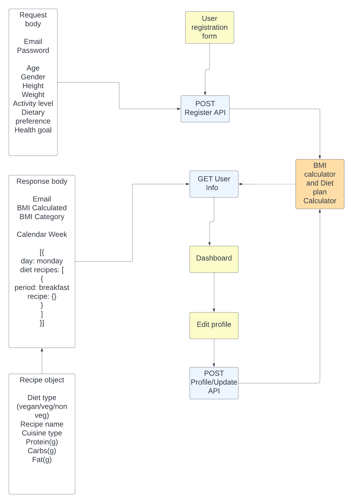

# daphne-api

---

# Solution Design Document

## Personalised Diet Planner Based on BMI

---

## Index

* [Objective and Features](#objective-and-features)
* [Systems Involved](#systems-involved)
* [Assumptions](#assumptions)
* [Process Flow](#process-flow)
* [Solution Details](#solution-details)
* [Risks and Edge Cases](#risks-and-edge-cases)

---

## Objective and Features

### Objective

Develop a Personalized diet planner based on BMI.

### Features

* User Registration
* BMI Calculator
* Diet Plan Generator
* Nutritional Information
* User Dashboard

---

## Systems Involved

* **Deployment**: AWS / Azure
* **Backend**: Node / Express
* **Database**: MySQL
* **Frontend**: React / Vite
* **State Management**: Zustand

---

## Database

### User

* `User id`
* `Email`
* `Password` (hash encoded)

### Users Information

* `User Information id`
* `User id`
* `DOB`
* `Gender`
* `Height`
* `Weight`
* `Activity level` (1.2 to 1.9)
* `Dietary preference`
* `Health goal`
* `BMI` (calculated)
* `Status` (active/inactive)
* `Created at`

> **Note:** User data is never deleted. On update, a new entry is created to maintain history.

### Recipes

* `Recipe id`
* `Diet type` (vegan/veg/non-veg)
* `Recipe name`
* `Cuisine type`
* `Protein (g)`
* `Carbs (g)`
* `Fat (g)`

> Master table for recipes.

### Diet Plan

* `Plan id`
* `User id`
* `Status` (active/inactive)
* `Created at`
* `System generated` (true/false)

> Each diet will have multiple recipes. Future scope allows user to edit diets.
> Edit operation will create a new entry with `system generated = false`.

### Mapping Diet (one) to Recipes (many)

* `Map id`
* `Diet id`
* `Recipe id`
* `Period` (breakfast/lunch/dinner/snack)

> Each diet plan entry is mapped to many recipes.

---

## Process Flow



---

## Solution Details

### Diet Plan Generator

* **Macronutrient Ratio**: Protein\:Carbs\:Fat = 40:30:30
* **Calorie Needs Formula**:

  ```
  Calorie needs = BMR * Activity Level
  ```

### Formula for BMR: Mifflin-St Jeor Equation

* For **men**:

  ```
  BMR = 10W + 6.25H - 5A + 5
  ```

* For **women**:

  ```
  BMR = 10W + 6.25H - 5A - 161
  ```

> Activity factor is kept between 1.2 to 1.9

---

## API List

- POST user/register: handles login iif user exists, if not create new user
- GET user: handles fetching user data, included diet plan
- UPDATE user: handles update for user details


## Controller Function list

- Check user exists
- Add new user
- Generate diet plan
---
